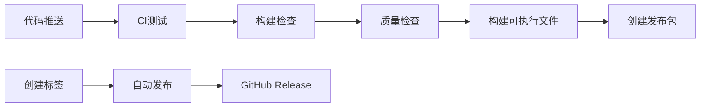

# 🚀 EvoBot控制系统 - CI/CD 集成


## 📦 自动化构建

本项目已配置完整的GitHub Actions CI/CD流水线，专门针对Windows环境优化。

### 🎯 主要特性

- ✅ **自动构建**: 每次推送自动构建Windows可执行文件
- 🧪 **多版本测试**: 支持Python 3.10-3.12测试
- 📦 **自动发布**: 标签推送自动创建GitHub Release
- 🔍 **依赖检查**: 每周自动检查依赖更新和安全问题
- 🛡️ **质量保证**: 代码格式、类型检查、测试覆盖率

### 📋 工作流程



### 🚀 快速开始

#### 1. 获取最新版本
```bash
# 从Releases页面下载最新版本
# 或者克隆仓库自行构建
git clone https://github.com/your-username/evobot-control-system.git
cd evobot-control-system
```

#### 2. 本地开发环境
```bash
# 自动修复Windows依赖
python fix-windows-deps.py

# 或手动安装
pip install -r requirements-windows.txt
```

#### 3. 运行程序
```bash
python main.py
```

### 🔧 开发者指南

#### 提交代码
```bash
# 1. 创建功能分支
git checkout -b feature/new-feature

# 2. 开发和测试
python test_deps.py
python main.py

# 3. 提交代码
git add .
git commit -m "feat: 添加新功能"
git push origin feature/new-feature

# 4. 创建Pull Request
# GitHub会自动运行CI测试
```

#### 发布新版本
```bash
# 1. 更新版本号 (pyproject.toml)
# 2. 创建标签
git tag v1.0.1
git push origin v1.0.1

# 3. GitHub Actions自动构建和发布
```

### 📊 构建状态

| 工作流 | 状态 | 描述 |
|--------|------|------|
| Windows Build & Test |  | 主要构建和测试流程 |
| Windows CI |  | 完整CI测试流程 |
| Dependency Check |  | 依赖安全检查 |

### 📦 下载

#### 稳定版本
- 访问 [Releases页面](https://github.com/your-username/evobot-control-system/releases)
- 下载 `EvoBot-Windows.zip`
- 解压后直接运行 `EvoBot控制系统.exe`

#### 开发版本
- 访问 [Actions页面](https://github.com/your-username/evobot-control-system/actions)
- 下载最新构建的Artifacts

### 🛠️ 故障排除

#### 常见问题

**Q: PyQt5安装失败**
```bash
A: 运行 python fix-windows-deps.py 自动修复
```

**Q: 程序无法启动**
```bash
A: 检查是否安装了Visual C++ Redistributable
   下载地址: https://aka.ms/vs/17/release/vc_redist.x64.exe
```

**Q: 串口连接失败**
```bash
A: 1. 检查COM端口是否被占用
   2. 确认串口驱动已安装
   3. 尝试不同的波特率设置
```

#### 获取帮助

- 🐛 [报告Bug](https://github.com/your-username/evobot-control-system/issues/new?template=bug_report.md)
- 💡 [功能请求](https://github.com/your-username/evobot-control-system/issues/new?template=feature_request.md)
- 📖 [查看文档](./docs/)
- 💬 [讨论区](https://github.com/your-username/evobot-control-system/discussions)

### 🔄 更新日志

查看 [CHANGELOG.md](./CHANGELOG.md) 了解版本更新详情。

---

**注意**: 请将 `your-username` 替换为实际的GitHub用户名或组织名。